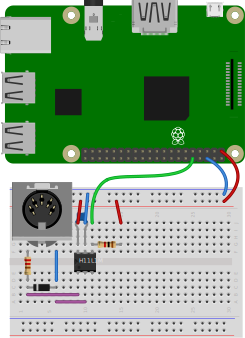

[](https://github.com/dwhinham/mt32-pi/actions?query=workflow:"mt32-pi+CI")
[](https://commons.wikimedia.org/wiki/File:MT_32.jpg)

## 🎹🎶 mt32-pi

A work-in-progress baremetal Roland MT-32 emulator for the Raspberry Pi 3 or above, based on [Munt] and [Circle].
Turn your Raspberry Pi into a dedicated emulation of the [famous multi-timbre sound module](https://en.wikipedia.org/wiki/Roland_MT-32) used by countless classic MS-DOS and Sharp X68000 games, that starts up in seconds!

## Project status

* Tested on Raspberry Pi 4 Model B and Raspberry Pi 3 Model B+.
  + It's _possible_ that the Pi 2 may be good enough, but I don't have one for testing. Can you help?
  + Pi 0 and 1 are unfortunately too slow, even with an overclock.
* PWM headphone jack audio.
  + Quality is known to be poor (aliasing/distortion on quieter sounds).
  + It is not currently known whether this can be improved or not.
* USB or GPIO MIDI interface.
* I2S Hi-Fi DAC support is **almost ready** (feel free to open an issue if you have a DAC HAT and want to test!).
* LCD status screen support (for MT-32 SysEx messages and status information) is **in progress**.

## Quick-start guide

* Download the latest release from the [Releases] section.
* Extract contents to a blank FAT32-formatted SD card.
  + If you are updating an old version, you can just replace the `kernel*.img` files. The other boot files will not change often; but keep an eye on the [changelog] just in case.
* Add `MT32_CONTROL.ROM` and `MT32_PCM.ROM` to the root of the SD card - you have to provide these for copyright reasons.
* Connect a [USB MIDI interface](#confirmed-working-usb-midi-interfaces) or [GPIO MIDI circuit](#gpio-midi-interface) to the Pi, and connect some speakers to the headphone jack.
* Connect your vintage PC's MIDI OUT to the Pi's MIDI IN and (optionally) vice versa.

## MIDI connection examples

``` 
[ Pi ] --> [ USB/GPIO MIDI ] <===> [ USB MIDI ] <-- [ Modern PC ]
[ Pi ] --> [ USB/GPIO MIDI ] <===> [ Gameport MIDI cable ] <-- [ Vintage PC ]
[ Pi ] --> [ USB/GPIO MIDI ] <===> [ Atari ST or other machine with built-in MIDI ]
[ Pi ] --> [ USB/GPIO MIDI ] <===> [ Synthesizer keyboard or controller ]
```

## Confirmed working USB MIDI interfaces

Any class-compliant USB MIDI interface should work fine - if the interface works on Windows or Linux PCs without requiring any drivers, there's a high chance it will work with `mt32-pi`.

**Beware**: cheap no-name interfaces are not recommended; they have reliability issues not unique to this project [[1], [2]].

If you're shopping for a USB MIDI interface, the following devices have been confirmed as working properly by our testers. Feel free to contribute test results with your own MIDI interfaces and we can list known working ones!
 
| Manufacturer | Device                                                           | Comments                                               |
|--------------|------------------------------------------------------------------|--------------------------------------------------------|
| M-Audio      | [Uno](https://m-audio.com/products/view/uno)                     | 1 in, 1 out; male DIN plugs. Tested by @dwhinham.      |
| M-Audio      | [MIDISport 1x1](https://m-audio.com/products/view/midisport-1x1) | 1 in, 1 out; female DIN sockets. Tested by @nswaldman. |

## GPIO MIDI interface

You can build a simple circuit based on an opto-isolator, a diode, and a few resistors. If `mt32-pi` does not detect any USB MIDI devices present on startup, it will expect to receive input on the UART RX pin (pin 10).

### Schematic


### Breadboard example


## FAQ

* **Q:** What happened to the old `mt32-pi` project that was based on a minimal Linux distro built with Buildroot?  
  **A:** That's been archived in the [`old-buildroot`](https://github.com/dwhinham/mt32-pi/tree/old-buildroot) branch.

## Disclaimer

This project, just like [Munt], has no affiliation with Roland Corporation. Use of "Roland" or other registered trademarks is purely for informational purposes only, and implies no endorsement by or affiliation with thheir respective owners.

## Acknowledgments

* Many thanks go out to @rc55 and @nswaldman for their encouragement and testing! ❤️
* The [Munt] team for their incredible work reverse-engineering the Roland MT-32 and producing an excellent emulation and well-structured project.
* The [Circle] and [circle-stdlib] projects for providing the best C++ baremetal framework for the Raspberry Pi.

[1]: http://www.arvydas.co.uk/2013/07/cheap-usb-midi-cable-some-self-assembly-may-be-required/
[2]: https://karusisemus.wordpress.com/2017/01/02/cheap-usb-midi-cable-how-to-modify-it/
[Releases]: https://github.com/dwhinham/mt32-pi/releases/latest
[Changelog]: https://github.com/dwhinham/mt32-pi/blob/master/CHANGELOG.md
[Circle]: https://github.com/rsta2/circle
[circle-stdlib]: https://github.com/smuehlst/circle-stdlib
[Munt]: https://github.com/munt/munt
