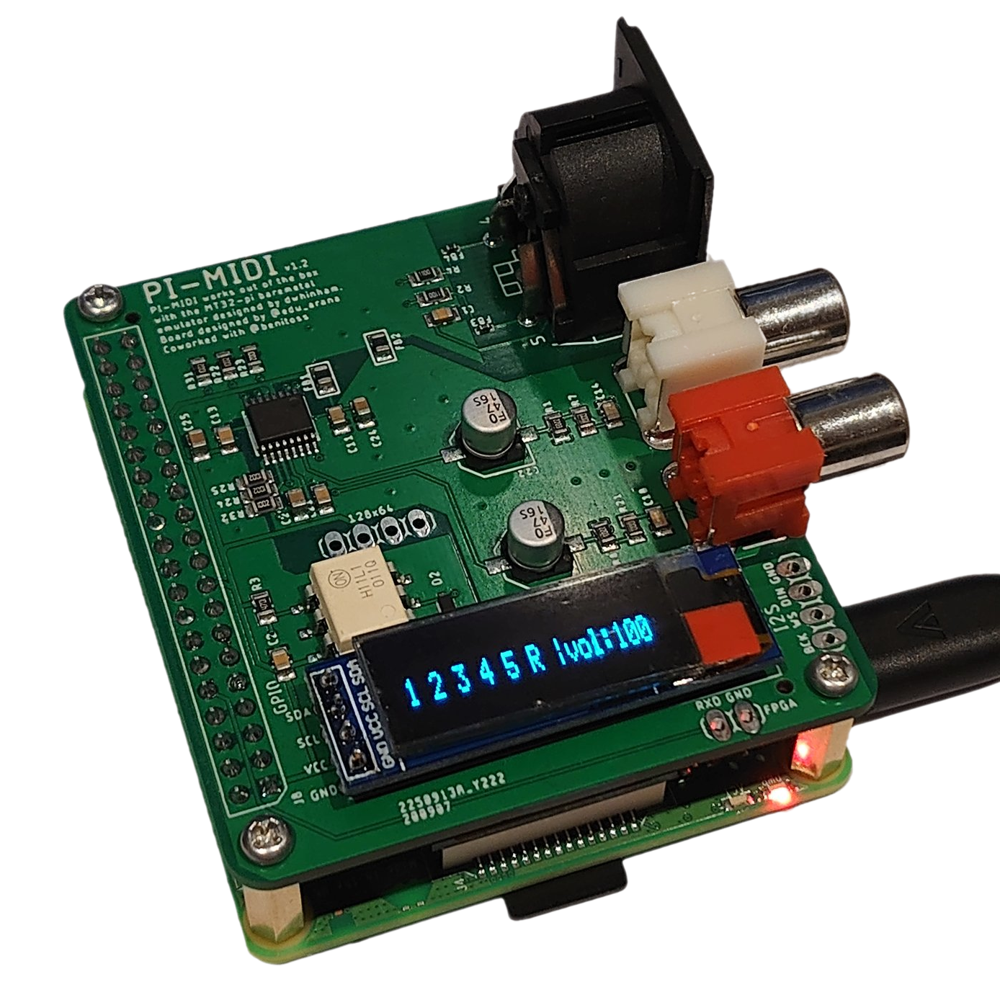

<h1 align="center">
    <a href="https://donation.dec.org.uk/ukraine-humanitarian-appeal">
        
         
        🇺🇦 mt32-pi stands with Ukraine 🇺🇦
    </a>
</h1>

- A work-in-progress baremetal MIDI synthesizer for the Raspberry Pi 3 or above, based on [Munt], [FluidSynth] and [Circle].
- Turn your Raspberry Pi into a dedicated emulation of the [famous multi-timbre sound module][Roland MT-32] used by countless classic MS-DOS, PC-98 and Sharp X68000 games!
- Add your favorite [SoundFonts][SoundFont] to expand your synthesizer with [General MIDI], [Roland GS], or even [Yamaha XG] support for endless MIDI possibilities.
- Includes General MIDI and Roland GS support out of the box thanks to [GeneralUser GS] by S. Christian Collins.
- No operating system, no complex Linux audio configuration; just super-low latency audio.
- Easy to configure and ready to play from cold-boot in a matter of seconds.
- The perfect companion for your vintage PC or [MiSTer FPGA] setup.

---

## ✔️ Project status

- Supports Raspberry Pi Zero 2 W, Raspberry Pi 3 Model A+, B, and B+, Raspberry Pi 4 Model B, and CM4 series.
  * Pi 2 works, but only with concessions on playback quality.
  * Pi Zero (original) and Pi 1 are unfortunately too slow (even with an overclock) and unsupported.
- PWM headphone jack audio.
  * Quality is known to be poor (aliasing/distortion on quieter sounds).
  * It is not currently known whether this can be improved or not.
- [I²S Hi-Fi DAC support][I²S Hi-Fi DACs].
  * This is the recommended audio output method for the best quality audio.
- MIDI input via [USB][USB MIDI interfaces], [GPIO][GPIO MIDI interface] MIDI interfaces, or the [serial port].
- [Configuration file] for selecting hardware options and fine tuning.
- [LCD status screen support][LCD and OLED displays] (for MT-32 SysEx messages and status information).
- Simple [physical control surface][control surface] using buttons and rotary encoder.
- [MiSTer FPGA integration via user port][MiSTer FPGA].
- Network MIDI support via [RTP-MIDI] and [raw UDP socket].
- [Embedded FTP server][FTP server] for remote access to files.
- A user interface with menu system is _planned_.
- More advanced MIDI routing is _planned_.

## ✨ Quick-start guide

🆕 If you have a Linux computer or MiSTer FPGA device, you may wish to try the new interactive [mt32-pi installer script](scripts).

Otherwise, for a manual installation:

1. Download the latest release from the [Releases] section.
    * If you are **updating an old version**, read the [Updating mt32-pi] wiki page for the correct procedure.
2. Extract contents to a blank [FAT32-formatted SD card][SD card preparation].
    * Read the [SD card preparation] wiki page for hints on formatting an SD card correctly (especially under Windows).
3. For MT-32 support, add your MT-32 or CM-32L ROM images to the `roms` directory - you have to provide these for copyright reasons.
    * You will need at least one control ROM and one PCM ROM.
    * For information on using multiple ROM sets and switching between them, see the [MT-32 synthesis] wiki page.
    * The file names or extensions don't matter; mt32-pi will scan and detect their types automatically.
4. Optionally add your favorite SoundFonts to the `soundfonts` directory.
    * For information on using multiple SoundFonts and switching between them, see the [SoundFont synthesis] wiki page.
    * Again, file names/extensions don't matter.
5. Edit the `mt32-pi.cfg` file to enable any optional hardware (Hi-Fi DAC, displays, buttons). Refer to [the wiki][mt32-pi wiki] to find supported hardware.
    * **MiSTer users**: Read the [MiSTer setup] section of the wiki for the recommended configuration, and ignore the following two steps.
6. Connect a [USB MIDI interface][USB MIDI interfaces] or [GPIO MIDI circuit][GPIO MIDI interface] to the Pi, and connect some speakers to the headphone jack.
7. Connect your vintage PC's MIDI OUT to the Pi's MIDI IN and (optionally) vice versa.

## 📚 Documentation

More detailed documentation for mt32-pi can now be found over at the [mt32-pi wiki]. Please read the wiki pages to learn about all of mt32-pi's features and supported hardware, and consider helping us improve it!

## ❓ Help

Take a look at our [FAQ] page for answers to the most common questions about mt32-pi.

If you need some help with mt32-pi and the wiki doesn't answer your questions, head over to the [discussions] area and feel free to start a topic.

> ⚠ **Note**: Please don't use the Issues area to ask for help - Issues are intended for reproducible bug reports and feature requests. Thank you!

## ❤️ Contributing

This project is generally quite stable and very usable, but still considered by its author to be in early stages of development.

Hence, please **DO NOT** work on large features and open pull requests without prior discussion. There is a strong possibility that work-in-progress code for proposed features already exists, but may not yet be public, and your work will have to be rejected.

Trivial changes to the code that fix issues are always welcome, as are improvements to documentation, and hardware/software compatibility reports.

## ⚖️ License

This project's source code is licensed under the [GNU General Public License v3.0][license].

The [mt32-pi logo] was designed by and is © Dale Whinham. The terms of use for the logo are as follows:

- The logo **MAY** be used on open-source community hardware.
- The logo **MAY** be used to link back to this repository or for similar promotional purposes of a strictly **non-commercial nature** (e.g. blog posts, social media, YouTube videos).
- The logo **MUST NOT** be used on or for the marketing of closed-source or commercial hardware (e.g. case designs, PCBs), without express permission.
- The logo **MUST NOT** be used for any other commercial products or purposes without express permission.
- The shape and overall design of the logo **MUST NOT** be modified or distorted. You **MAY** change the colors if required.
- If in any doubt, please ask. Thank you.

## 🙌 Acknowledgments

- Many thanks go out to @rc55 and @nswaldman for their encouragement and testing! ❤️
- A huge thank you to everyone who has donated via Ko-fi, PayPal, or Amazon - your support means a lot! ❤️
- Special thanks to [Edu Arana (Arananet)], [Porkchop Express (MiSTerAddons)], @djhardrich, [Nat (MiSTerFPGA.co.uk)], [Ricardo Saraiva (UltimateMiSTer.com)], [Serge Defever (Serdashop)], and @opjose who have all generously donated hardware to the project.
- The [Munt] team for their incredible work reverse-engineering the Roland MT-32 and producing an excellent emulation and well-structured project.
- The [FluidSynth] team for their excellent and easily-portable SoundFont synthesizer project.
- [S. Christian Collins][GeneralUser GS] for the excellent GeneralUser GS SoundFont and for kindly giving permission to include it in the project.
- The [Circle] and [circle-stdlib] projects for providing the best C++ baremetal framework for the Raspberry Pi.
- The [inih] project for a nice, lightweight config file parser.

[Changelog]: https://github.com/dwhinham/mt32-pi/blob/master/CHANGELOG.md
[circle-stdlib]: https://github.com/smuehlst/circle-stdlib
[Circle]: https://github.com/rsta2/circle
[Configuration file]: https://github.com/dwhinham/mt32-pi/wiki/Configuration-file
[Control surface]: https://github.com/dwhinham/mt32-pi/wiki/Control-surface
[Discussions]: https://github.com/dwhinham/mt32-pi/discussions
[Edu Arana (Arananet)]: https://www.arananet.net/pedidos
[FAQ]: https://github.com/dwhinham/mt32-pi/wiki/FAQ
[FluidSynth]: http://www.fluidsynth.org
[FTP server]: https://github.com/dwhinham/mt32-pi/wiki/Embedded-FTP-server
[General MIDI]: https://en.wikipedia.org/wiki/General_MIDI
[GeneralUser GS]: http://schristiancollins.com/generaluser.php
[GPIO MIDI interface]: https://github.com/dwhinham/mt32-pi/wiki/GPIO-MIDI-interface
[I²S Hi-Fi DACs]: https://github.com/dwhinham/mt32-pi/wiki/I%C2%B2S-DACs
[inih]: https://github.com/benhoyt/inih
[LCD and OLED displays]: https://github.com/dwhinham/mt32-pi/wiki/LCD-and-OLED-displays
[License]: https://github.com/dwhinham/mt32-pi/blob/master/LICENSE
[MiSTer FPGA]: https://github.com/dwhinham/mt32-pi/wiki/MiSTer-FPGA
[MiSTer setup]: https://github.com/dwhinham/mt32-pi/wiki/MiSTer-FPGA%3A-Setup-and-usage
[MT-32 synthesis]: https://github.com/dwhinham/mt32-pi/wiki/MT-32-synthesis
[mt32-pi logo]: https://github.com/dwhinham/mt32-pi/blob/master/images/mt32pi_logo.svg
[mt32-pi wiki]: https://github.com/dwhinham/mt32-pi/wiki
[Munt]: https://github.com/munt/munt
[Nat (MiSTerFPGA.co.uk)]: https://misterfpga.co.uk
[Porkchop Express (MiSTerAddons)]: https://misteraddons.com
[Releases]: https://github.com/dwhinham/mt32-pi/releases
[Ricardo Saraiva (UltimateMiSTer.com)]: https://ultimatemister.com
[Roland GS]: https://en.wikipedia.org/wiki/Roland_GS
[Roland MT-32]: https://en.wikipedia.org/wiki/Roland_MT-32
[RTP-MIDI]: https://github.com/dwhinham/mt32-pi/wiki/Networking%3A-RTP-MIDI-%28AppleMIDI%29
[Raw UDP socket]: https://github.com/dwhinham/mt32-pi/wiki/Networking%3A-UDP-MIDI
[SD card preparation]: https://github.com/dwhinham/mt32-pi/wiki/SD-card-preparation
[Serge Defever (Serdashop)]: http://serdashop.com
[Serial port]: https://github.com/dwhinham/mt32-pi/wiki/MIDI-via-RS-232-or-USB-to-serial
[SoundFont synthesis]: https://github.com/dwhinham/mt32-pi/wiki/SoundFont-synthesis
[SoundFont]: https://en.wikipedia.org/wiki/SoundFont
[Updating mt32-pi]: https://github.com/dwhinham/mt32-pi/wiki/Updating-mt32-pi
[USB MIDI interfaces]: https://github.com/dwhinham/mt32-pi/wiki/USB-MIDI-interfaces
[Yamaha XG]: https://en.wikipedia.org/wiki/Yamaha_XG
