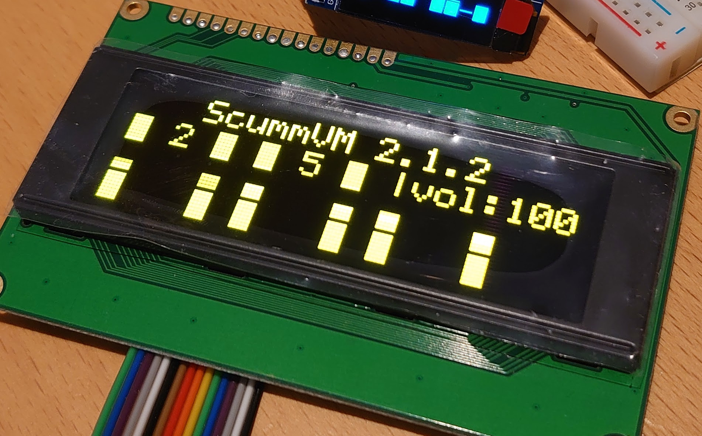
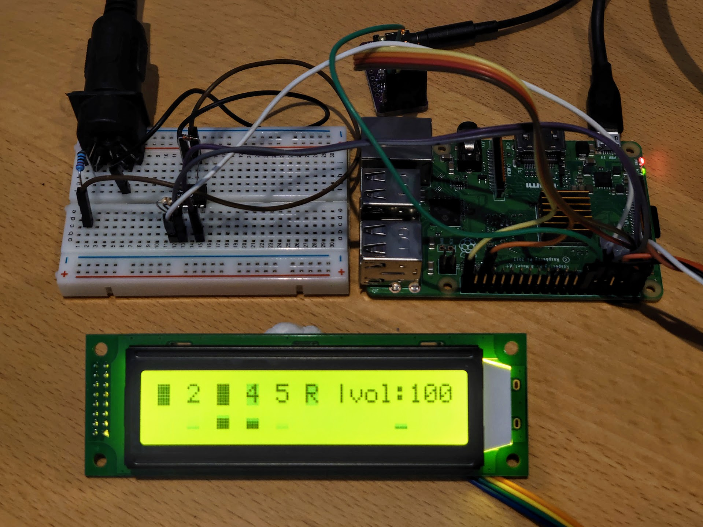
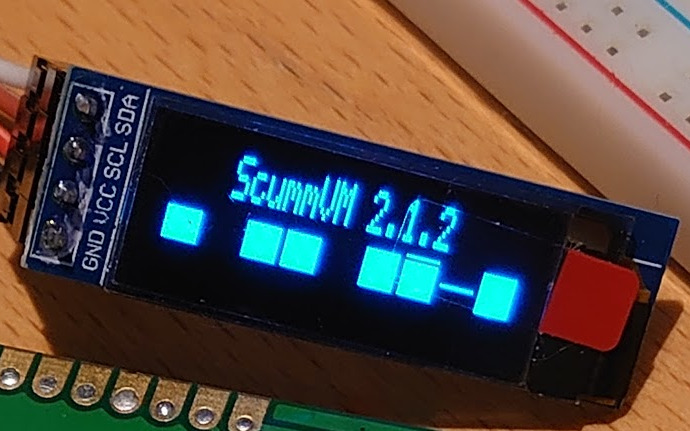
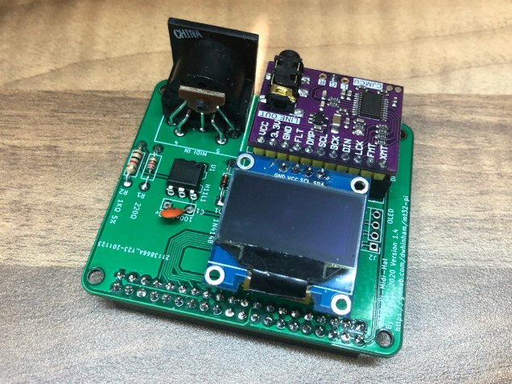
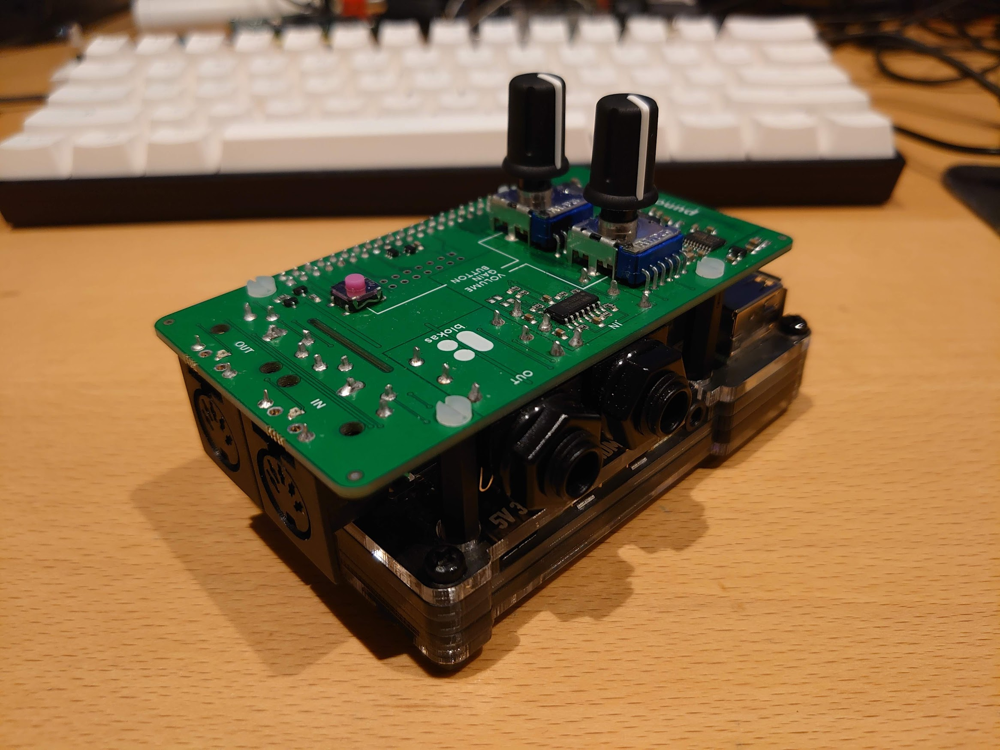

[](https://github.com/dwhinham/mt32-pi/actions?query=workflow:"mt32-pi+CI")
[](https://commons.wikimedia.org/wiki/File:MT_32.jpg)

## 🎹🎶 mt32-pi

- A work-in-progress baremetal MIDI synthesizer for the Raspberry Pi 3 or above, based on [Munt], [FluidSynth] and [Circle].
- Turn your Raspberry Pi into a dedicated emulation of the [famous multi-timbre sound module](https://en.wikipedia.org/wiki/Roland_MT-32) used by countless classic MS-DOS, PC-98 and Sharp X68000 games!
- 🆕 Add your favorite [SoundFonts][SoundFont] to expand your synthesizer with [General MIDI], [Roland GS], or even [Yamaha XG] support for endless MIDI possibilities.
- 🆕 Includes General MIDI and Roland GS support out of the box thanks to [GeneralUser GS] by S. Christian Collins.
- No operating system, no complex Linux audio configuration; just super-low latency audio.
- Easy to configure and ready to play from cold-boot in a matter of seconds.
- The perfect companion for your vintage PC or [MiSTer] FPGA setup.

## 🔖 Table of contents

<!-- Generated with jonschlinkert/markdown-toc -->
<!-- Needs manual emoji fixup because of https://github.com/jonschlinkert/markdown-toc/issues/119 -->

<!-- toc -->

- [✔️ Project status](#%EF%B8%8F-project-status)
- [✨ Quick-start guide](#-quick-start-guide)
- [📝 Configuration file](#-configuration-file)
- [🎹 MIDI connectivity](#-midi-connectivity)
  * [USB MIDI interfaces](#usb-midi-interfaces)
    + [Compatibility](#compatibility)
  * [GPIO MIDI interface](#gpio-midi-interface)
    + [Schematic](#schematic)
    + [Breadboard example](#breadboard-example)
    + [Serial ports](#serial-ports)
- [🔊 I²S DAC support](#-is-dac-support)
  * [Setup](#setup)
  * [Compatibility](#compatibility)
  * [Finding the I²C address of your DAC](#finding-the-ic-address-of-your-dac)
- [📺 LCD and OLED displays](#-lcd-and-oled-displays)
  * [Drivers](#drivers)
    + [Hitachi HD44780 compatible 4-bit driver (`hd44780_4bit`)](#hitachi-hd44780-compatible-4-bit-driver-hd44780_4bit)
    + [Hitachi HD44780 compatible I²C driver (`hd44780_i2c`)](#hitachi-hd44780-compatible-ic-driver-hd44780_i2c)
    + [SSD1306 I²C driver (`ssd1306_i2c`)](#ssd1306-ic-driver-ssd1306_i2c)
  * [Compatibility](#compatibility-1)
- [🧠 MT-32 ROM support](#-mt-32-rom-support)
  * [ROM scanning](#rom-scanning)
  * [Switching ROM sets](#switching-rom-sets)
- [🎺 SoundFont support](#-soundfont-support)
  * [SoundFont scanning](#soundfont-scanning)
  * [Switching SoundFonts](#switching-soundfonts)
- [🔩 Custom hardware](#-custom-hardware)
    + [clumsyMIDI](#clumsymidi)
    + [mt32-pi-midi-hat](#mt32-pi-midi-hat)
    + [PI-MIDI](#pi-midi)
	+ [Pisound](#pisound)
- [💬 Custom System Exclusive messages](#-custom-system-exclusive-messages)
- [❓ FAQ](#-faq)
- [⚖️ Disclaimer](#%EF%B8%8F-disclaimer)
- [🙌 Acknowledgments](#-acknowledgments)

<!-- tocstop -->

## ✔️ Project status

- Tested on Raspberry Pi 4 Model B and Raspberry Pi 3 Model A+, B, and B+.
  * Pi 2 works, but only with concessions on playback quality.
  * Pi 0 and 1 are unfortunately too slow, even with an overclock.
- PWM headphone jack audio.
  * Quality is known to be poor (aliasing/distortion on quieter sounds).
  * It is not currently known whether this can be improved or not.
- [I²S Hi-Fi DAC support](#-is-dac-support).
  * This is the recommended audio output method for the best quality audio.
- [USB](#usb-midi-interfaces) or [GPIO](#gpio-midi-interface) MIDI interface.
- [Config file](#-configuration-file) for selecting hardware options and fine tuning.
- [LCD status screen support](#-lcd-and-oled-displays) (for MT-32 SysEx messages and status information).
- Control buttons, rotary encoder etc. is _planned_.
- Network MIDI and auto-update is _planned_.

## ✨ Quick-start guide

- Download the latest release from the [Releases] section.
- Extract contents to a blank FAT32-formatted SD card.
  * If you are updating an old version, you can just replace the `kernel*.img` files. The other boot files will not change often; but keep an eye on the [changelog] just in case.
- For MT-32 support, add your MT-32 or CM-32L ROM images to the `roms` directory - you have to provide these for copyright reasons.
  * You will need at least one control ROM and one PCM ROM.
  * For information on using multiple ROM sets and switching between them, see the [MT-32 ROM support](#-mt-32-rom-support) section.
  * The file names or extensions don't matter; `mt32-pi` will scan and detect their types automatically.
- Optionally add your favorite SoundFonts to the `soundfonts` directory.
  * For information on using multiple SoundFonts and switching between them, see the [SoundFont support](#-soundfont-support) section.
  * Again, file names/extensions don't matter.
- Connect a [USB MIDI interface](#usb-midi-interfaces) or [GPIO MIDI circuit](#gpio-midi-interface) to the Pi, and connect some speakers to the headphone jack.
- Connect your vintage PC's MIDI OUT to the Pi's MIDI IN and (optionally) vice versa.

## 📝 Configuration file

`mt32-pi` tries to read a configuration file from the root of the SD card named `mt32-pi.cfg`. Please read the file for a description of all the available options. 

> ⚠️ **Note:** Don't confuse this file with `config.txt` or `cmdline.txt` - they are for configuring the Raspberry Pi itself, and you should not need to alter these when using `mt32-pi`.

## 🎹 MIDI connectivity

For the Raspberry Pi to be able to receive MIDI data, it needs a MIDI interface. The simplest way is to connect an off-the-shelf [USB MIDI interface](#usb-midi-interfaces) to one of its USB ports. More advanced users or electronics enthusiasts may wish to build a [GPIO MIDI interface](#gpio-midi-interface) instead.

Here are some typical connection examples:

``` 
[ Pi ] --> [ USB/GPIO MIDI ] <===> [ USB MIDI ] <-- [ Modern PC ]
[ Pi ] --> [ USB/GPIO MIDI ] <===> [ Gameport MIDI cable ] <-- [ Vintage PC ]
[ Pi ] --> [ USB/GPIO MIDI ] <===> [ Atari ST or other machine with built-in MIDI ]
[ Pi ] --> [ USB/GPIO MIDI ] <===> [ Synthesizer keyboard or controller ]
```

### USB MIDI interfaces

If you want to receive MIDI on the Pi using a USB MIDI interface, any class-compliant interface should work fine. If the interface works on Windows or Linux PCs without requiring any drivers, there's a high chance it will work with `mt32-pi`.

Please check [our wiki page](https://github.com/dwhinham/mt32-pi/wiki/USB-MIDI-interfaces) for recommended interfaces and compatibility reports. 

> ⚠️ **Beware:** cheap no-name interfaces are not recommended; they have reliability issues not unique to this project [[1], [2], [3]].

### GPIO MIDI interface

You can build a simple circuit based on an opto-isolator, a diode, and a few resistors. If `mt32-pi` does not detect any USB MIDI devices present on startup, it will expect to receive input on the UART RX pin (pin 10).

> 💡 **Tip:** You can disable detection of USB MIDI interfaces by setting `usb = off` in the config file. This can shave off a couple of seconds of boot time as USB initialization is then skipped on startup.

#### Schematic


#### Breadboard example


#### Serial ports 

You can also skip the MIDI circuitry and drive `mt32-pi` using a serial port directly using software such as [Hairless MIDI] or [SoftMPU] and suitable cabling. Use the `gpio_baud_rate` option in the configuration file to match up `mt32-pi` with your host's serial port baud rate.

> ⚠️ **Note:** Remember that the Raspberry Pi expects no more than 3.3V on its GPIO pins, so make sure that you use appropriate level shifting when interfacing with other hardware to prevent damage to the Pi.

## 🔊 I²S DAC support

The Raspberry Pi's headphone jack is a simple PWM device, and not designed for high-fidelity audio. This becomes very obvious when you use `mt32-pi` - distortion in the sound is apparent when quieter sounds are playing.

Luckily, a plethora of inexpensive DAC ([digital-to-analog converter]) hardware is available for the Raspberry Pi, giving it true hi-fi quality audio output. These often take the form of an easy-to-install "HAT" board that you place onto the Raspberry Pi's GPIO pins. They make use of the Raspberry Pi's I²S bus for interfacing.

> ⚠️ **Note:** We do not support any kind of USB DAC audio output device, due to the lack of drivers in the [Circle] baremetal framework that we depend on. Adding USB audio support to Circle would be a huge undertaking, although if that changes in the future and Circle gains USB audio support, we could certainly make use of it.

### Setup

- `mt32-pi` defaults to PWM (headphone) output. Edit `mt32-pi.cfg` and change `output_device` to `i2s` to enable the I²S DAC driver.
- If your DAC requires software configuration, you may need to edit the `i2c_dac_address` and `i2c_dac_init` options to suit your particular DAC. Continue reading for further details.

### Compatibility

Currently, we have been targeting DACs based on the Texas Instruments PCM5xxx series of chips due to their popularity, but other DACs could be supported quite easily.
The NXP UDA1334 is also reportedly working well.

Some more advanced DACs are configured by software (normally a Linux driver), whereas others need no configuration as they are preconfigured in hardware. This will vary between manufacturers, and so some editing of `mt32-pi.cfg` may be required.

> ⚠️ **Note:** If a DAC requires software configuration, they will not produce any sound until they have been properly initialized. This initialization is done by sending it a special sequence of commands over the I²C (not I²S) bus. For the PCM5xxx family, you can set `i2c_dac_init = pcm51xx` to enable this.

Feel free to open an issue if you'd like to help us support your DAC, or even just to report success or failure so that we can build a list of supported DACs.

The following models of DAC have been confirmed as working by our testers. Please note the necessary configuration file options.

| Manufacturer | Device             | DAC chip | Additional config file options                         | Comments                                                                                                               |
|--------------|--------------------|----------|--------------------------------------------------------|------------------------------------------------------------------------------------------------------------------------|
| Arananet     | [PI-MIDI]          | UDA1334  | None required                                          | Stereo RCA output. Custom design by @arananet also with GPIO MIDI in. Tested by @dwhinham.                             |
| Blokas       | [Pisound]          | PCM5102A | Ensure `sample_rate` is set to 48000, 96000, or 192000 | Stereo 6.35mm output, volume knob, and integrated SPI MIDI interface. Tested by @dwhinham and @sigkill.                |
| chris-jh     | [mt32-pi-midi-hat] | PCM5102A | None required                                          | Stereo 3.5mm output. Custom free/open source design by @chris-jh also with GPIO MIDI in. Tested by @gmcn42.            |
| Generic      | [GY-PCM5102]       | PCM5102A | None required                                          | Stereo 3.5mm output. Found very cheaply on AliExpress and other sites. Tested by @dwhinham.                            |
| Generic      | [Pi-Fi DAC+ v2.0]  | PCM5122  | `i2c_dac_init = pcm51xx`, `i2c_dac_address = 4d`       | Stereo RCA and 3.5mm output. Tested by @rc55.                                                                          |
| gmcn42       | [clumsyMIDI]       | PCM5102A | None required                                          | Stereo 3.5mm output. Custom free/open source design by @gmcn42 also with GPIO MIDI in and out/thru. Tested by @gmcn42. |
| innomaker    | [HiFi DAC HAT]     | PCM5122  | `i2c_dac_init = pcm51xx`, `i2c_dac_address = 4d`       | Stereo RCA and 3.5mm output. Tested by @calvinmorrow.                                                                  |
| IQaudIO      | [Pi-DAC Pro]       | PCM5242  | `i2c_dac_init = pcm51xx`, `i2c_dac_address = 4c`       | Stereo RCA and 3.5mm output. Tested by @dwhinham.                                                                      |

### Finding the I²C address of your DAC

The `i2c_dac_address` configuration file option determines what address on the I²C bus that `mt32-pi` will send initialization commands to, if `i2c_dac_init` is not set to `none`.

If your DAC does not appear in the compatibility table above, you can help by carrying out the following:

- Connect the DAC to your Raspberry Pi.
- Insert an SD card containing the latest version of Raspberry Pi OS (aka. Raspbian) and boot the Pi.
- Run the command `sudo raspi-config`.
- Select "Interfacing Options", followed by "I²C" and "Yes" to enable the I²C kernel modules.
- Exit `raspi-config`, and run the command `sudo apt-get install i2c-tools` to install some I²C utilities.
- Run the command `i2cdetect -y 1`. The output should be like the following:
  ```
       0  1  2  3  4  5  6  7  8  9  a  b  c  d  e  f
  00:          -- -- -- -- -- -- -- -- -- -- -- -- -- 
  10: -- -- -- -- -- -- -- -- -- -- -- -- -- -- -- -- 
  20: -- -- -- -- -- -- -- -- -- -- -- -- -- -- -- -- 
  30: -- -- -- -- -- -- -- -- -- -- -- -- -- -- -- -- 
  40: -- -- -- -- -- -- -- -- -- -- -- -- -- UU -- -- 
  50: -- -- -- -- -- -- -- -- -- -- -- -- -- -- -- -- 
  60: -- -- -- -- -- -- -- -- -- -- -- -- -- -- -- -- 
  70: -- -- -- -- -- -- -- --          
  ```
- In this example, the address is **4d**. Make a note of this and set `i2c_dac_address` in `mt32-pi.cfg`.
- If your DAC now works, open an issue to let us know, and we can add it to the table! Otherwise, open an issue anyway, and we can try to work out how to support it.

## 📺 LCD and OLED displays

`mt32-pi` supports various LCD and OLED displays, both traditional character displays like the original MT-32, and modern graphical displays.

The MT-32 had a single row, 20 column display, but these are hard to find nowadays. 20x2 and 20x4 displays are common however, and `mt32-pi` can use the extra rows to display additional information.

To enable a display, you will need to edit `mt32-pi.cfg` accordingly, and correctly connect your display to the Raspberry Pi.

### Drivers

There are currently three different LCD drivers, which are detailed in the following sections.

#### Hitachi HD44780 compatible 4-bit driver (`hd44780_4bit`)

[](docs/hd44780_20x4.jpg)

This driver is for connecting a traditional HD44780 or compatible (e.g. Winstar WS0010/Raystar RS0010) character display directly to the Pi's GPIO pins in 4-bit mode.
Currently, only 20x2 and 20x4 displays are supported.

Consult your display's datasheet to determine the correct LCD pins to connect to the GPIOs. The current pinout is as follows:

| LCD signal | Physical Raspberry Pi pin | BCM pin |
|------------|---------------------------|---------|
| `RS`       | 19                        | 10      |
| `RW`       | 21                        | 9       |
| `EN`       | 23                        | 11      |
| `D4`       | 27                        | 0       |
| `D5`       | 29                        | 5       |
| `D6`       | 31                        | 6       |
| `D7`       | 33                        | 13      |

You will also need to connect a power source and ground to your display. Consult its datasheet to see if it requires 3.3V or 5V. You should be able to use the Pi's 3.3V, 5V, and ground pins as necessary, but **check the datasheet** to ensure the display doesn't draw more current than the Pi can deliver safely.

> ⚠️ **Note:** The GPIO assignment could change in later versions as more functionality is added, so **BE WARNED** if you are thinking about designing hardware.

#### Hitachi HD44780 compatible I²C driver (`hd44780_i2c`)

[](docs/hd44780_20x2.jpg)

This driver is functionally equivalent to the 4-bit driver, but instead of using GPIOs to drive the LCD's data signals directly, the Pi communicates with the display via an I²C-connected I/O expander. Some vendors refer to these as an "[I²C backpack]".

These displays are very convenient as they only need 4 wires to connect to the Pi. Your display will connect to the Pi's `SDA` and `SCL` lines (pins 3 and 5 respectively), as well as power and ground. As always, **check your display's datasheet** for power requirements.

As with all I²C devices, you must know the LCD's I²C address in order for it to work. You should be able to find its address on the datasheet, or the "backpack" may have jumpers to configure the address. In case of doubt, you can connect the display and use Linux to discover your display using the [same procedure described in the DAC section](#-finding-the-i2c-address-of-your-DAC).

#### SSD1306 I²C driver (`ssd1306_i2c`)

[](docs/ssd1306_128x32.jpg)

The SSD1306 controller is found in mini 128x32 and 128x64 OLED displays, which are well-known for their use in FlashFloppy/Gotek devices. They can be found for very little money on eBay and AliExpress.

Currently, only 128x32 and 128x64 variants are supported. These displays usually have an I²C address of `0x3c`.

Some displays can be used with both I²C and SPI interfaces and may need to be reconfigured by setting some resistors on the back of the assembly. `mt32-pi` currently only supports I²C displays, so read your display's documentation to learn how to put it into I²C mode.

This driver should also work with SSD1309 displays such as the [Diymore 2.42" OLED][2.42" OLED], but the display may need some small modifications to ensure it is in I²C mode, that the address is correct, and to deal with any reset signals.

### Compatibility

The following displays and configurations have been confirmed as working by our testers. Please note the necessary configuration file options.

| Manufacturer   | Device          | Config file options                                                        | Comments                                                                                                                                                                 |
|----------------|-----------------|----------------------------------------------------------------------------|--------------------------------------------------------------------------------------------------------------------------------------------------------------------------|
| BuyDisplay.com | [2002-1 Series] | `type = hd44780_i2c`, `width = 20`, `height = 2`, `i2c_lcd_address = 27`   | Very bright and inexpensive 20x2 LCD. Tested by @dwhinham.                                                                                                               |
| Diymore        | [2.42" OLED]    | `type = ssd1306_i2c`, `width = 128`, `height = 64`, `i2c_lcd_address = 3c` | Large 128x64 OLED. Requires modifications: R4 removed, R3 shorted, R5 shorted, DC tied to GND, RES tied to GND via a 10K pull-down resistor [[4]]. Tested by @flynnsbit. |
| Generic        | [128x32 OLED]   | `type = ssd1306_i2c`, `width = 128`, `height = 32`, `i2c_lcd_address = 3c` | Extremely cheap yet nice and bright mini OLED. Widely available on AliExpress and eBay. Tested by @dwhinham.                                                             |
| Generic        | [128x64 OLED]   | `type = ssd1306_i2c`, `width = 128`, `height = 64`, `i2c_lcd_address = 3c` | Similar to the 32 pixel high OLED, just with more rows. Tested by @dwhinham.                                                                                             |
| Raystar        | [REC002004B]    | `type = hd44780_4bit`, `width = 20`, `height = 4`                          | High-contrast 20x4 OLED display. Tested by @dwhinham.                                                                                                                    |

## 🧠 MT-32 ROM support

`mt32-pi` can make use of all ROMs that [Munt] supports, and allows switching between ROM sets on-the-fly for greater compatibility with various games. For further information about which games work best with each ROM set, consult the [MT-32 game compatibility list].

A ROM set consists of:

- a **control ROM** (contains the code that runs on the MT-32's CPU).
- a **PCM ROM** (contains the sound samples).

For simplicity, `mt32-pi` categorizes the known control ROMs into three types:

1. **MT-32 (old)**: The original version of the MT-32, ROM versions 1.xx.
2. **MT-32 (new)**: The later version of the MT-32, ROM versions 2.xx.
3. **CM-32L**: A "computer music" module compatible with the MT-32, but with additional sound effects for games, and the LCD/buttons removed.

As for PCM ROMs, there are only two known versions - the MT-32 version (common to both models of MT-32), and the CM-32L version.

To summarize, to get the most out of `mt32-pi`, you'll need **5 ROM files in total** - old/new/CM-32L control ROMs, and MT-32/CM-32L PCM ROMs.

> ⚠️ **Note:** To use the MT-32 synthesizer, you must either set it as the default synth in the config file, or switch to it at runtime using a [custom SysEx message](#-custom-system-exclusive-messages).

### ROM scanning

On startup, `mt32-pi` will scan the `roms` directory and load the first ROM it encounters that matches each category. In other words, if you have two "old" control ROMs (e.g. version 1.05 and 1.07), only one of them will be used and assigned to the "old" category slot. Therefore, it's recommended that you only place **one ROM per category** in the `roms` directory.

When multiple ROM sets are available, the default set to load on startup can be set in the [configuration file](#-configuration-file).

### Switching ROM sets

You can use a [custom SysEx message](#-custom-system-exclusive-messages) to make `mt32-pi` quickly swap ROM sets at runtime. If the ROM set is available and loaded, the emulated MT-32 will be restarted with the new ROMs active.

It may be useful to create scripts (e.g. a DOS batch file) that send `mt32-pi` ROM set swap messages before launching a game.

In the future, `mt32-pi` will allow you to switch ROM sets from a menu or button combination.

## 🎺 SoundFont support

[SoundFont] is a file format that allows sound samples, instrument mappings and synthesizer behaviors to be stored in a self-contained package. Any SoundFont-compliant synthesizer software or hardware can then load the SoundFont and, in theory, produce the same audio output. The SoundFont was made popular by the Creative Labs Sound Blaster AWE32 and later family of sound cards, which used it to provide reconfigurable MIDI synthesis for use with games and for music production purposes.

The flexibility of the SoundFont standard means that several MIDI specifications such as [General MIDI], [Roland GS], and [Yamaha XG] can be implemented with the same synthesizer engine, opening up a wide range of possibilities.

`mt32-pi` uses the [FluidSynth] engine to provide SoundFont support, and comes with the [GeneralUser GS] SoundFont so that you have excellent General MIDI and Roland GS compatibility out of the box.

> ⚠️ **Note:** To use the SoundFont synthesizer, you must either set it as the default synth in the config file, or switch to it at runtime using a [custom SysEx message](#-custom-system-exclusive-messages).

### SoundFont scanning

On startup, `mt32-pi` will scan the `soundfonts` directory and perform a quick test on each file to search for valid SoundFonts. SoundFonts are then added to a list, and sorted into lexicographical order (i.e. 0-9, A-Z).

The [configuration file](#-configuration-file) allows you to change which SoundFont should be loaded when multiple SoundFonts are available.

### Switching SoundFonts

Just like with MT-32 ROMs, you can use a [custom SysEx message](#-custom-system-exclusive-messages) to make `mt32-pi` swap SoundFonts at runtime.

The configuration file and custom SysEx messages for SoundFont switching use a **zero-based index** into a sorted list of valid SoundFonts. This means that `0` is the first, `1` is the second, and so on.

When switching, the current SoundFont is unloaded from memory, and the chosen SoundFont is (re)loaded from SD card. This may take some seconds depending on the size of the file, speed of the SD card, and model of Raspberry Pi.

This behavior may be improved in the future - it will be possible to implement a (pre)caching system to keep frequently-used SoundFonts in memory. There are also some caveats with large SoundFonts and Pi models with low RAM - see the [FAQ](#-faq) for notes on this.

In the future, `mt32-pi` will allow you to switch SoundFonts from a menu or button combination.

## 🔩 Custom hardware

The community has been designing some excellent custom hardware for use with `mt32-pi`. If you have created something cool with `mt32-pi`, please get in touch if you'd like to share it and have it featured here.

> ⚠️ **Note:** If you are designing custom hardware for `mt32-pi`, and want to add features that are not documented here, open an issue so we can work together on supporting it.

### clumsyMIDI

[][clumsyMIDI]

[clumsyMIDI] is a free and open source PCB by @gmcn42 aimed at DIYers, which features an OLED display, MIDI input, MIDI output (or thru), and space for an inexpensive DAC module with stereo 3.5mm output. The board is designed to be easy to assemble, using only through-hole components so that even the "clumsiest" electronics enthusiasts can build their own interface for `mt32-pi`!

<br clear="right"/>

### mt32-pi-midi-hat

[][mt32-pi-midi-hat]

The [mt32-pi-midi-hat] is a free and open source PCB by @chris-jh aimed at DIYers, which features a MIDI input, space for a 128x32 or 128x64 OLED display, and space for one of two different inexpensive DAC modules with stereo 3.5mm output. This board is also designed to be easy to assemble, using only through-hole components.

<br clear="right"/>

### PI-MIDI

[][PI-MIDI]

The [PI-MIDI] by @arananet is a pre-assembled device which provides an OLED display, MIDI input, and a DAC with stereo RCA outputs for a complete plug 'n' play experience. The newest versions also feature a useful input jack with volume control for mixing-in stereo audio from a host computer.

<br clear="right"/>

### Pisound

[][Pisound]

The [Pisound] by Blokas is a commercial Raspberry Pi sound card with DAC, ADC (recording device) and MIDI interface, and is the closest product available to a "professional" audio device. Currently, only the MIDI input and audio output is supported by `mt32-pi`.

<br clear="right"/>

## 💬 Custom System Exclusive messages

`mt32-pi` responds to MT-32 SysEx messages as you would expect, but it can also respond to its own commands. `mt32-pi` listens for manufacturer ID `0x7D`, or the "non-commercial/educational use" special ID. Therefore, a complete `mt32-pi` SysEx message looks like:

```
F0 7D { command } { parameters } F7
```

> ⚠️ **Note:** These commands are subject to change until the project reaches a mature state.

| Command   | Description              | Parameters                                                                                  |
|-----------|--------------------------|---------------------------------------------------------------------------------------------|
| `00`      | Reboot the Raspberry Pi. | None                                                                                        |
| `01` `xx` | Switch ROM set.          | `xx` = `00`: MT-32 (old)<br>`xx` = `01`: MT-32 (new)<br>`xx` = `02`: CM-32L                 |
| `02` `xx` | Switch SoundFont.        | `xx` = Zero-based index into contents of `soundfonts` directory (lexicographically sorted). |
| `03` `xx` | Switch synthesizer.      | `xx` = `00`: MT-32<br>`xx` = `01`: SoundFont                                                |

## ❓ FAQ

- **Q:** I'm trying to play sounds on `mt32-pi` using my MIDI keyboard controller but I'm not hearing anything - what's wrong?  
  **A:** Your keyboard is probably sending note data on **channel 1**, but by default, on power-up the MT-32 is set to receive on MIDI **channels 2-10**. Check your keyboard's documentation to see if you can change the transmit channel. If this isn't possible, [see this wiki page](https://github.com/dwhinham/mt32-pi/wiki/MIDI-channel-assignment) for more information on how to reassign the emulated MT-32's channels.
- **Q:** I'm getting sound distortion and/or the power LED on my Raspberry Pi is blinking - why?  
  **A:** It's possible that the Pi is not receiving enough power. Try swapping the USB cable being used to power the Pi, or try another power supply. Check the [Raspberry Pi power supply page] for recommended power supply specifications.
- **Q:** Why don't I see any video output on my HDMI-connected monitor or television? Has the Pi has failed to boot?  
  **A:** This is completely normal - `mt32-pi` is designed to run headless and therefore there is no video output. For troubleshooting purposes, it's possible to compile `mt32-pi` with HDMI debug logs enabled, but these builds will hang on a Raspberry Pi 4 if **no** HDMI display is attached due to a quirk of the Pi 4 and Circle. Hence, for regular use, video output is disabled.
- **Q:** What happened to the old `mt32-pi` project that was based on a minimal Linux distro built with Buildroot?  
  **A:** That's been archived in the [`old-buildroot`](https://github.com/dwhinham/mt32-pi/tree/old-buildroot) branch.

## ⚖️ Disclaimer

This project, just like [Munt], has no affiliation with Roland Corporation. Use of "Roland" or other registered trademarks is purely for informational purposes only, and implies no endorsement by or affiliation with their respective owners.

## 🙌 Acknowledgments

- Many thanks go out to @rc55 and @nswaldman for their encouragement and testing! ❤️
- The [Munt] team for their incredible work reverse-engineering the Roland MT-32 and producing an excellent emulation and well-structured project.
- The [FluidSynth] team for their excellent and easily-portable SoundFont synthesizer project.
- [S. Christian Collins][GeneralUser GS] for the excellent GeneralUser GS SoundFont and for kindly giving permission to include it in the project.
- The [Circle] and [circle-stdlib] projects for providing the best C++ baremetal framework for the Raspberry Pi.
- The [inih] project for a nice, lightweight config file parser.

[1]: http://www.arvydas.co.uk/2013/07/cheap-usb-midi-cable-some-self-assembly-may-be-required/
[128x32 OLED]: https://www.aliexpress.com/item/32661842518.html
[128x64 OLED]: https://www.aliexpress.com/item/32233334632.html
[2.42" OLED]: https://www.diymore.cc/products/2-42-inch-12864-oled-display-module-iic-i2c-spi-serial-for-arduino-c51-stm32-green-white-blue-yellow
[2]: https://karusisemus.wordpress.com/2017/01/02/cheap-usb-midi-cable-how-to-modify-it/
[2002-1 Series]: https://www.buydisplay.com/character-lcd-display-module/20x2-character
[3]: http://www.fm-alive.com/Pages/DXMidi.aspx
[4]: https://forum.arduino.cc/index.php?topic=442255.30
[Changelog]: https://github.com/dwhinham/mt32-pi/blob/master/CHANGELOG.md
[circle-stdlib]: https://github.com/smuehlst/circle-stdlib
[Circle]: https://github.com/rsta2/circle
[clumsyMIDI]: https://github.com/gmcn42/clumsyMIDI
[digital-to-analog converter]: https://en.wikipedia.org/wiki/Digital-to-analog_converter
[FluidSynth]: http://www.fluidsynth.org/
[General MIDI]: https://en.wikipedia.org/wiki/General_MIDI
[GeneralUser GS]: http://schristiancollins.com/generaluser.php
[GY-PCM5102]: https://www.aliexpress.com/item/4000049720221.html
[Hairless MIDI]: https://projectgus.github.io/hairless-midiserial/
[HiFi DAC HAT]: https://www.amazon.com/gp/product/B07D13QWV9/
[I²C backpack]: https://www.adafruit.com/product/292
[inih]: https://github.com/benhoyt/inih
[MiSTer]: https://github.com/MiSTer-devel/Main_MiSTer/wiki
[MT-32 game compatibility list]: https://en.wikipedia.org/wiki/List_of_MT-32-compatible_computer_games#IBM_PC_compatibles
[mt32-pi-midi-hat]: https://github.com/chris-jh/mt32-pi-midi-hat
[Munt]: https://github.com/munt/munt
[Pi-DAC Pro]: https://web.archive.org/web/20191126140807/http://iqaudio.co.uk/hats/47-pi-dac-pro.html
[Pi-Fi DAC+ v2.0]: https://www.aliexpress.com/item/32872005777.html
[PI-MIDI]: https://www.arananet.net/pedidos/product/pi-midi-a-baremetal-mt32-emulator-using-raspberry-pi3
[Pisound]: https://blokas.io/pisound/
[Raspberry Pi power supply page]: https://www.raspberrypi.org/documentation/hardware/raspberrypi/power/README.md
[REC002004B]: https://www.raystar-optronics.com/oled-character-display-module/REC002004B.html
[Releases]: https://github.com/dwhinham/mt32-pi/releases/latest
[Roland GS]: https://en.wikipedia.org/wiki/Roland_GS
[SoftMPU]: http://bjt42.github.io/softmpu/
[SoundFont]: https://en.wikipedia.org/wiki/SoundFont
[Yamaha XG]: https://en.wikipedia.org/wiki/Yamaha_XG
