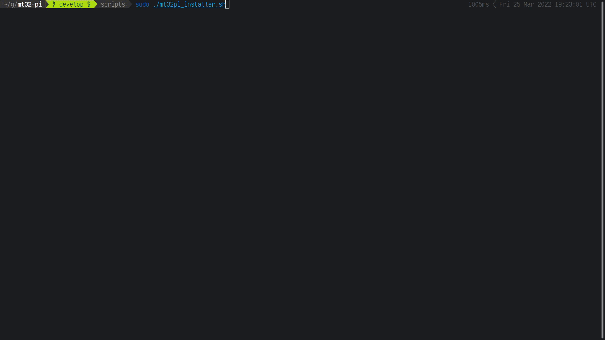

# Scripts for mt32-pi

## [`mt32pi_installer.sh`]

An interactive Bash script for performing a first-time installation of mt32-pi. Intended for use on MiSTer FPGA, but should be usable on any Linux PC. Simply attach an SD card reader to your machine and insert a microSD card, then run the script as root.

### Features

- Easy and friendly step-by-step operation with confirmation at each stage.
- Allows user to choose an SD card from a list, then partitions and formats it as FAT32.
- Downloads the latest release from GitHub, and extracts it to the SD card.
- Automatically edits the configuration files with the most common settings for use with MiSTer FPGA.
- Optionally allows the user to set up and enable Wi-Fi and FTP. Copies MiSTer Wi-Fi configuration if present.

### Limitations

- Assumes I²S audio output, 128x64 SSD1306 OLED, MiSTer OSD enabled, and `simple_encoder` control scheme.
- For performing **clean installation only**; does not save/restore settings or any extra files on the SD card.

### Usage

1. Download [`mt32pi_installer.sh`].
   - If you want to use it on MiSTer, copy it to the `/Scripts` directory on your SD card.
2. Make the script executable by typing `chmod +x mt32pi_installer.sh` at a shell prompt.
3. Insert a microSD card into a USB card reader, and then connect it to your Linux PC or MiSTer.
4. Run the script by typing `sudo ./mt32pi_installer.sh` at a shell prompt.
   - On MiSTer, you should see `mt32pi_installer` in the Scripts menu - simply select it to run the script.

## [`mt32pi_updater.py`]

A non-interactive Python 3 script for automatically updating your mt32-pi via the embedded FTP server. Intended for use on MiSTer FPGA, but should be usable on any Linux PC.

A wrapper script ([`mt32pi_updater.sh`]) is provided so that it can be launched from the MiSTer OSD's Scripts menu.

### Features

- Self-updating.
- Connects to your mt32-pi via FTP and compares the installed version with the latest version available on GitHub.
- Exits early if your mt32-pi is up-to-date.
- Shows the release notes for a few seconds before updating.
- Creates a backup of your `mt32-pi.cfg`.
- Intelligently merges your old `mt32-pi.cfg` settings into the latest template from the installation package, so that new options and documentation are preserved along with your old settings.
- Restores your old `config.txt` and `wpa_supplicant.conf`.

### Limitations

- Does not intelligently merge your `config.txt` or `wpa_supplicant.conf`, but these files rarely change. Instead, the latest versions from the installation package are copied to your SD card as `config.txt.new` and `wpa_supplicant.conf.new` so that you may check and manually update them if necessary.

### Usage

1. Download [`mt32pi_updater.py`] and [`mt32pi_updater.cfg`].
   - If you want to use it on MiSTer, download the [the wrapper script][`mt32pi_updater.sh`] too, and copy both scripts (`.py` and `.sh`) and the `.cfg` file to the `/Scripts` directory on your SD card.
2. Make the script(s) executable by typing `chmod +x mt32pi_updater.{py,sh}` at a shell prompt.
3. If you have set a custom hostname, IP address or FTP username/password in `mt32-pi.cfg`, edit the `host`, `ftp_username` and `ftp_password` settings inside `mt32pi_updater.cfg` so that they match.
4. Run the script by typing `./mt32pi_updater.py` at a shell prompt.
   - On MiSTer, you should see `mt32pi_updater` in the Scripts menu - simply select it to run the script.

[`mt32pi_installer.sh`]: mt32pi_installer.sh?raw=1
[`mt32pi_updater.py`]: mt32pi_updater.py?raw=1
[`mt32pi_updater.cfg`]: mt32pi_updater.cfg?raw=1
[`mt32pi_updater.sh`]: mt32pi_updater.sh?raw=1
